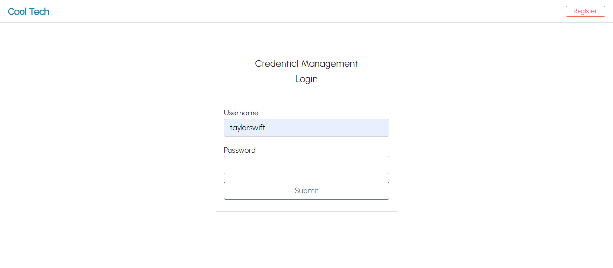
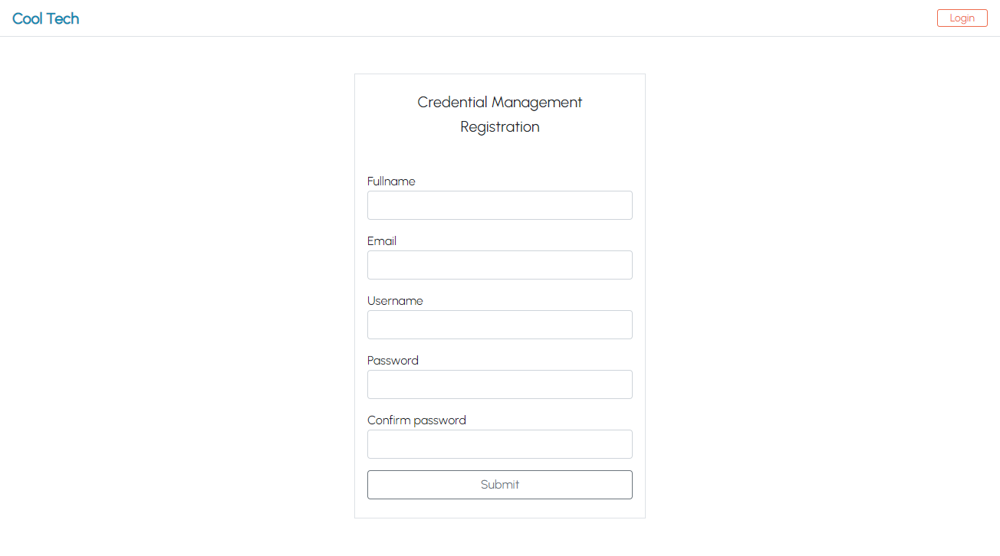
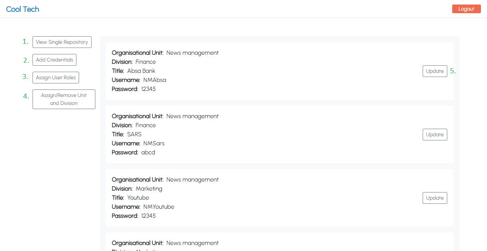

<h1 align="center">Cool Tech Credential Management Application</h1>

An application to manage Cool Tech's credentials.

## Table of Contents

* [About the Application](#about-the-application)
* [Installation](#installation)
* [Usage](#usage)
* [Acknowledgments](#acknowledgments)

## About the Application

See root folder's **README.md**.
`credential-management/README.md`

## Installation

See root folder's **README.md**.
`credential-management/README.md`

## Usage

 * User login.

 

 * User registration. 
  

 * Portal
  

 1. View a single division's credential repository.
 2. Add new credentials.
 3. Assign user roles.
 4. Assign/remove users to/from units and divisions.
 5. Update existing credentials.

## Acknowledgments

**HyperionDev**

Certified Full Stack Web and Software Engineer 
